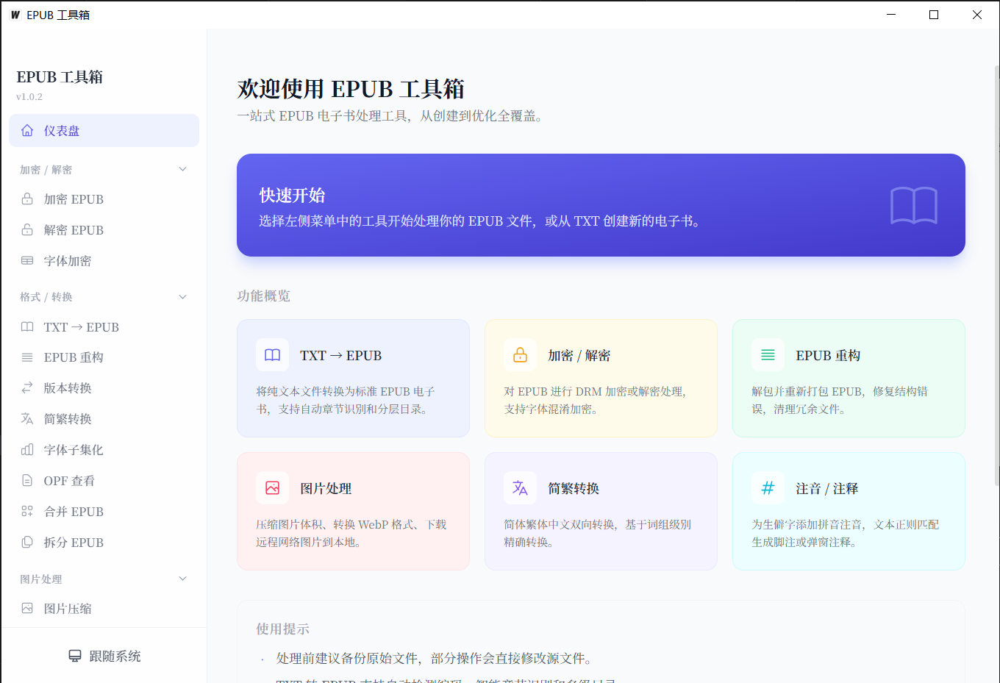

# Epub Tool->ET->E-Book Thor->📖🔨->（AI生成）

   

  
<strong>桌面版说明</strong>

  

当前默认桌面版基于 `Tauri 2 + Vue 3 + TypeScript + Python 后端`。核心 EPUB 处理能力仍由 `utils/` 提供，并通过 `python_backend/` 统一为可调用的任务入口；桌面界面负责文件导入、参数配置、任务执行、日志与结果展示。 

主要目录：

- `frontend/`：桌面前端界面
- `src-tauri/`：Tauri 壳层与打包配置
- `python_backend/`：统一 CLI、任务协议与运行器
- `doc/`：运行、协议与打包说明

推荐先看：

- `doc/README.md`
- `doc/CLI_USAGE.md`
- `doc/TASK_PROTOCOL.md`
- `doc/TAURI_PYTHON_BRIDGE.md`
- `doc/BUILD_AND_BUNDLE.md`

桌面版当前支持：

- 选择单个或多个 EPUB 文件
- 扫描目录并递归收集 `.epub`
- 独立设置输出目录
- 执行 `reformat / decrypt / encrypt / font_encrypt / transfer_img`
- 查看处理日志、执行摘要、失败与跳过原因
- 持久化保存常用设置与最近任务历史

本地开发启动：

1. 安装 Python 依赖：`python -m pip install -r requirements.txt`。 
2. 安装 Node / npm / Rust toolchain。 
3. 如使用 `nvm`，执行 `source "$HOME/.nvm/nvm.sh"` 与 `nvm use`。 
4. 安装前端与 Tauri 依赖：`npm install`、`npm --prefix frontend install`。 
5. 启动桌面应用：`npm run tauri:dev`。 

本地打包：

1. 安装 Python 依赖与 PyInstaller：`python -m pip install -r requirements.txt pyinstaller`。 
2. 构建内置 Python sidecar：`python build_tool/build_python_sidecar.py`。 
3. 执行 Tauri 打包：`npm run tauri:build`。 

说明：打包产物会优先使用内置的 `src-tauri/binaries/epub-tool-python(.exe)`；只有本地开发时 sidecar 不存在，才会回退到系统 `python3` / `python`。应用版本号统一以 `src-tauri/Cargo.toml` 为准，GitHub Release 默认会自动派生为带 `v` 前缀的标签。 

  

  
<strong>怎么使用？</strong>

  

桌面版使用（推荐）：

1. 从 [Releases](https://github.com/cnwxi/epub_tool/releases/latest) 下载对应系统的桌面版安装包或压缩包。 
2. 安装并启动桌面应用。首次运行如遇系统安全提示，请按系统提示允许应用启动。 
3. 在桌面界面中导入 EPUB 文件或扫描目录。 
4. 选择输出目录与处理模式，然后执行任务。 
5. 处理完成后，可在结果区打开输出文件夹，并查看失败或跳过原因。 

桌面版支持：

- 格式化
- 文件解密
- 文件加密
- 字体加密
- 图片转换

UI 操作演示：

Python 脚本调试方式：

1. 安装 Python（推荐 3.8 或更高版本）。 
2. 安装依赖：`python -m pip install -r requirements.txt`。 
3. 单独调试处理脚本时，可直接执行 `python utils/*.py`。 

说明：

- Python 脚本入口主要用于排障与单功能调试，不作为默认使用入口。
- 执行脚本时，仍会在工作路径生成 `log.txt`。 

  

  
<strong>仓库包含哪些能力？</strong>

  

当前仓库主要提供以下 EPUB 处理能力：

- `utils/reformat_epub.py`：重构 EPUB 结构并标准化文件布局
- `utils/decrypt_epub.py`：处理文件名混淆
- `utils/encrypt_epub.py`：生成文件加密版本
- `utils/encrypt_font.py`：按字体范围执行字体加密
- `utils/transfer_img.py`：转换 EPUB 内 WEBP 图片

  

 
引用本仓库进行二次开发并扩展功能的项目 <b>epub-gadget</b>(推荐)

  

> Github仓库链接：[epub-gadget](https://github.com/wangyyyqw/epub-gadget)  
> PS：混淆加密功能更新可能存在延迟

  

  
<strong>执行遇到错误怎么办？</strong>

  

常见排查建议：

1. 先尝试使用“格式化”功能重新整理 EPUB 结构，再查看结果区与 `log.txt` 提示。 
2. 若处理失败，优先检查 EPUB 内部是否缺少或损坏关键文件，例如 `content.opf`。 
3. 字体加密仅处理 EPUB 内已嵌入的字体文件；如果样式引用的是系统字体，不会被加密。 
4. 若书籍包含特殊加密信息，例如掌阅相关加密标记，本仓库不提供对应解密能力。 

反馈问题时建议一并提供：

- 出现问题的 EPUB 文件或最小可复现样本
- 对应处理模式
- 生成的 `log.txt`
- 结果区显示的失败或跳过原因

  

  
<strong>更新日志</strong>

  

[点击查看 CHANGELOG](./CHANGELOG.md)

  

  
<strong>鸣谢</strong>

  

感谢以下用户和项目对此仓库的贡献：

- [遥遥心航](https://tieba.baidu.com/home/main?id=tb.1.7f262ae1.5_dXQ2Jp0F0MH9YJtgM2Ew)
- [lgernier](https://github.com/lgernierO)
- [fontObfuscator](https://github.com/solarhell/fontObfuscator)

  

