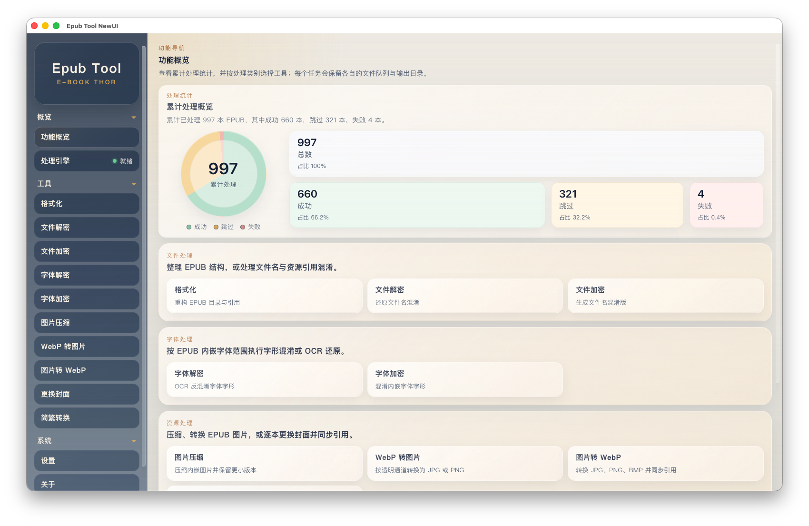

# Epub Tool

<p align="center">
  
</p>

<p align="center">
  <a href="https://github.com/cnwxi/epub_tool/releases/latest">
    
  </a>
  <a href="https://github.com/cnwxi/epub_tool/stargazers">
    
  </a>
  <a href="https://github.com/cnwxi/epub_tool/network/members">
    
  </a>
  <a href="https://github.com/cnwxi/homebrew-tap">
    
  </a>
</p>

一个面向 EPUB 批量处理的桌面工具。当前主入口已经切换到 `Tauri 2 + Vue 3 + TypeScript + Python sidecar`，围绕“批量导入、统一执行、结果回看、日志定位”组织桌面工作流。文件解密/加密功能处理的是 EPUB 内文件名与资源引用混淆，不提供 DRM 内容解密。



支持的处理能力：

- `reformat_epub`：重构 EPUB 目录结构、OPF 清单与资源引用，标准化文件布局
- `decrypt_epub`：还原 EPUB 内文件名与资源引用混淆，不提供 DRM 内容解密
- `encrypt_epub`：生成文件名与资源引用混淆版 EPUB
- `encrypt_font`：按每本 EPUB 单独选择字体 family，对内嵌字体与正文映射执行字形混淆
- `decrypt_font`：按每本 EPUB 单独选择字体 family，渲染混淆字形，经内置 ONNX OCR 识别后回写正文，并用可见占位符标记低置信度字符
- `image_compress`：压缩 EPUB 内 JPEG、PNG 与 WebP 图片，仅保留体积更小的结果；可选将无透明通道 PNG 转为 JPEG
- `webp_to_img`：将 EPUB 内透明 WebP 转为 PNG、非透明 WebP 转为 JPEG，并同步更新清单和内容引用
- `image_to_webp`：将 EPUB 内 JPG、PNG、BMP 转为 WebP，并同步更新清单和内容引用；旧版阅读器可能不支持 WebP
- `replace_cover`：为每本 EPUB 指定 JPG、PNG 或 WebP 封面，并同步更新封面清单和内容页引用
- `chinese_convert`：使用 OpenCC 双向转换可见简体/繁体中文文本，保留资源路径、ID、CSS 与脚本内容

## 当前桌面版实现

桌面版通过统一任务界面提供文件导入、参数配置、批量执行、进度与日志查看、结果回顾等能力。不同处理功能复用同一套前后端任务协议，并可按各自需求扩展配置和交互。

## 安装

### macOS（Homebrew）

```bash
brew tap cnwxi/tap
brew install --cask epub-tool-newui
```

更新：

```bash
brew upgrade --cask epub-tool-newui
```

### 手动下载

1. 从 [Releases](https://github.com/cnwxi/epub_tool/releases/latest) 下载对应系统的桌面包。
2. 安装并启动应用。

## 使用方式

1. 在左侧切换功能类型。
2. 拖入 EPUB、选择文件，或扫描目录收集 `.epub`。
3. 根据当前任务选择输出目录。
4. 根据任务配置专属参数：字体任务需选择每本书的目标字体 family；图片任务可调整质量；`replace_cover` 需为每本书选择封面；`chinese_convert` 可选择转换方向。
5. 点击“开始执行”，在结果区查看摘要、失败原因、跳过原因，并按需打开输出目录或日志文件。

## 日志与输出

- 开发环境默认写入仓库根目录的 `log.txt`
- 打包版默认写入系统应用日志目录
- 设置页与关于页都会显示当前日志位置或默认日志路径说明
- 任务完成后可按设置自动打开输出目录或日志文件

常见日志目录：

- Windows：`%LOCALAPPDATA%\com.cnwxi.epubtool.newui\logs\log.txt`
- macOS：`~/Library/Logs/com.cnwxi.epubtool.newui/log.txt`
- Linux：`~/.local/share/com.cnwxi.epubtool.newui/logs/log.txt`

## 本地开发与编译

详见 [本地开发指南](./assets/docs/LOCAL_DEVELOPMENT.md)。其中包括 macOS、Windows、Linux 的
系统依赖，Python/Node.js 环境配置、桌面端启动、单独调试、打包依赖准备、Python sidecar
二进制编译、OCR 模型维护以及 `cargo metadata` 报错排查。

## 仓库结构

- `frontend/`：Vue 3 桌面前端
- `src-tauri/`：Tauri 壳层、命令桥接与打包配置
- `python_backend/`：统一 CLI、任务协议、运行器与 EPUB 处理服务
- `python_backend/services/`：各类底层 EPUB 处理实现与共享日志工具
- `scripts/`：sidecar 构建、资源准备与维护脚本
- `assets/docs/`：构建、协议与桥接说明
- `assets/img/`：README、前端与应用打包共用图像资源
- `tests/`：自动化测试
- `fixtures/`：本地测试样本与验证素材（默认不提交）

## 文档索引

- [`assets/docs/README.md`](./assets/docs/README.md)：文档总览
- [`assets/docs/LOCAL_DEVELOPMENT.md`](./assets/docs/LOCAL_DEVELOPMENT.md)：本地开发环境、启动、打包与排查
- [`assets/docs/CLI_USAGE.md`](./assets/docs/CLI_USAGE.md)：Python 后端 CLI 用法
- [`assets/docs/TASK_PROTOCOL.md`](./assets/docs/TASK_PROTOCOL.md)：前后端任务协议
- [`assets/docs/TAURI_PYTHON_BRIDGE.md`](./assets/docs/TAURI_PYTHON_BRIDGE.md)：Tauri 与 Python 桥接说明
- [`assets/docs/BUILD_AND_BUNDLE.md`](./assets/docs/BUILD_AND_BUNDLE.md)：本地构建、打包与发布说明

## 常见排查

- 处理失败时，先看“最近一次执行摘要”中的失败原因、跳过原因，再看“处理日志”
- 如果书籍结构异常，可先执行“格式化”再继续其他流程
- `encrypt_font` 只处理 EPUB 内已嵌入的字体，不处理系统字体
- `decrypt_font` 只使用内置 ONNX OCR 模型，不依赖系统 OCR 工具、Paddle Python 运行时或运行时联网下载
- `decrypt_epub` 只还原文件名与资源引用混淆；如果 EPUB 内容本身被 DRM 或加密资源保护，工具无法还原明文
- `image_to_webp` 的输出在 EPUB 2 或较旧的阅读器中可能无法显示
- `replace_cover` 会更新 EPUB 中常见的封面资源引用；未选择封面的队列项会跳过
- 如果 `content.opf` 等关键文件缺失或异常，相关任务可能直接失败
- 反馈问题时，可使用 [问题反馈模板](https://github.com/cnwxi/epub_tool/issues/new?template=bug_report.yml)，建议同时提供：
  - 当前任务类型
  - 问题描述
  - 样本文件
  - `log.txt`

## 更新日志

- [更新日志](./assets/docs/CHANGELOG.md)

## 鸣谢

- [遥遥心航](https://tieba.baidu.com/home/main?id=tb.1.7f262ae1.5_dXQ2Jp0F0MH9YJtgM2Ew)：提供原始 EPUB 重构与文件名/资源引用处理实现的参考。
- [lgernier](https://github.com/lgernierO)：提供本项目早期代码备份，并参与早期命令行整合、构建流程及 EPUB 处理脚本改进。
- [fontObfuscator](https://github.com/solarhell/fontObfuscator)：为内嵌字体字形混淆与还原能力提供参考。
- [epub-gadget](https://github.com/wangyyyqw/epub-gadget)：图片压缩、图片格式转换、更换封面和简繁转换等处理能力的复用来源。
